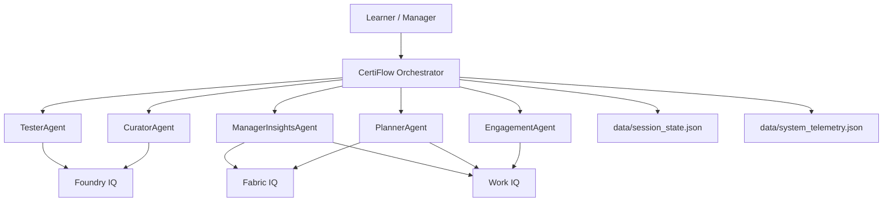

# CertiFlow Demo Script & Architecture (Short)

## Architecture (mermaid)



## 3-minute demo script

1. Start the backend UI:

```powershell
.venv\Scripts\python.exe -m uvicorn api:app --reload
```

2. Open http://127.0.0.1:8000/ and show the Quick UI.

3. Click **Generate Schedule** for `EMP-001` — explain: "Planner uses Foundry IQ (modules), Work IQ (availability), and Fabric IQ (role/context) to create a weekly schedule; persisted to `data/system_telemetry.json`."

4. Click **Generate Quiz** for a module (e.g., `Module 1: Core Compute & Storage Fabric`) — explain: "Tester agent creates an assessment based on Foundry content and sets it as active quiz."

5. Paste the sample submission and click **Submit Answers** — show verdict appended to telemetry.

6. Click **Engagement Nudge** and explain the selected best window.

7. Click **Manager Insights** and show the dashboard output.

8. Close with a note: "The system uses deterministic fallbacks when AI responses are invalid; we've added validations and tests to ensure schedules persist reliably." 


## Notes
- All data is synthetic and safe for demos. 
- Use the Swagger UI at `/docs` for low-level testing and the Quick UI for a guided demo.
