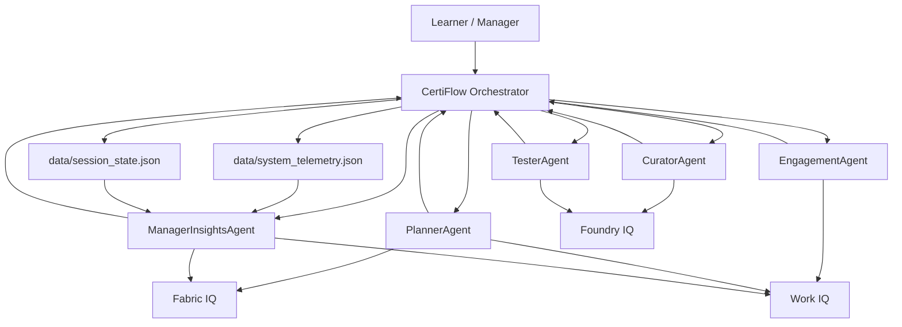

# CertiFlow

CertiFlow is a synthetic multi-agent enterprise learning system built for Battle #2, Reasoning Agents with Microsoft Foundry.

It helps organizations simulate certification planning by combining:

- `Foundry IQ` for grounded learning content
- `Work IQ` for work-pattern-aware study timing
- `Fabric IQ` for semantic role and readiness context

The system uses a multi-agent workflow to:

- curate learning paths,
- generate study plans,
- send context-aware engagement nudges,
- assess readiness with a critic/verifier loop,
- and produce manager-level dashboard insights.

## Project Goals

- Demonstrate multi-step reasoning across specialized agents
- Keep all data synthetic and demo-safe
- Show clear orchestration, telemetry, and inspection support
- Stay aligned with Microsoft Foundry challenge requirements

## Agent Roles

- `CuratorAgent` - maps a certification track to grounded learning content
- `PlannerAgent` - generates a study schedule from content, role, and workload context
- `EngagementAgent` - suggests a low-disruption reminder window from work signals
- `TesterAgent` - generates quizzes and evaluates answers with a critic/verifier loop
- `ManagerInsightsAgent` - renders a team dashboard and risk summary

## Data Layout

All data in `data/` is synthetic.

- `data/foundry_iq.json` - synthetic knowledge tracks and modules
- `data/fabric_iq.json` - synthetic employee and role context
- `data/work_iq.json` - synthetic busy blocks and learning windows
- `data/session_state.json` - core employee progression state
- `data/system_telemetry.json` - schedules, quiz submissions, manager summaries, and inspection logs

## Requirements

- Python 3.10+
- A virtual environment in `.venv`
- Azure / Microsoft Foundry access if you want live model calls

## Setup

1. Create and activate a virtual environment.

```powershell
python -m venv .venv
.venv\Scripts\activate
```

2. Install dependencies.

```powershell
pip install -r requirements.txt
```

3. Create a `.env` file in the project root.

```env
AZURE_AI_PROJECT_ENDPOINT=your-project-endpoint
AZURE_AI_MODEL_DEPLOYMENT=your-model-deployment
```

4. Seed the synthetic data.

```powershell
python seed_data.py
```

## Run

Start the demo pipeline:

```powershell
python orchestrator.py
```

Optional inspection action:

- `GENERATE_INSPECTION_REPORT` prints the backend inspection report

## What the demo shows

- schedule generation from synthetic work and knowledge context
- quiz generation from grounded learning content
- answer verification with a critic/verifier reasoning loop
- engagement nudges based on work windows
- manager dashboard reporting with telemetry and risk cues

## Architecture



### Diagram Notes

- `session_state.json` keeps the core employee lifecycle state.
- `system_telemetry.json` keeps schedules, quiz submissions, dashboard summaries, and inspection logs.
- `Foundry IQ` grounds content generation and assessment.
- `Fabric IQ` supports semantic planning and manager reasoning.
- `Work IQ` informs timing, reminders, and workload-aware decisions.

## Safety Notes

- This project uses synthetic data only.
- No real employee records, customer records, or personal data are included.
- Keep `.env` out of source control.

## Demo Notes

If Azure authentication is not available in your shell, the model calls will fail gracefully, but the state and inspection layers will still be visible.

## Suggested Next Step

If you want to present this in a strong way for judges, add:

- an architecture diagram,
- a short demo video,
- and a brief explanation of the agent loop and telemetry layer.

If you want a more polished version later, export the same structure as a PNG or SVG using a diagram tool.
